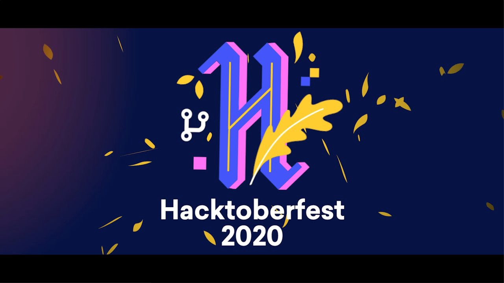

# HacktoberFest

## 

A repository to help budding developers have their first commit!

Hacktoberfest is open to everyone in our global community. All backgrounds and skill levels are encouraged to complete the challenge.

1. Hacktoberfest is a celebration open to everyone in our global community.
2. Pull requests can be made in any GitHub-hosted repositories/projects.
3. You can sign up anytime between October 1 and October 31.

### Contribute to Open Source and make a valid PR to complete the HactoberFest challenge...

## Steps for contribution

- Fork this repository
- Star the repo
- Add your details in the Contributors file
- You can also add basic programs in your favorite programming language, say Hello World :)
- Add file and commit the changes
- Make a PR (Pull Request)

And Have Fun!!!

## Getting started with Git

These are some useful resources for the beginners:

- [Git Tutorial](https://www.digitalocean.com/community/tutorials/how-to-contribute-to-open-source-getting-started-with-git)

- [Git CheatSheet](https://www.digitalocean.com/community/cheatsheets/how-to-use-git-a-reference-guide)

- [How to create a Pull Request](https://www.digitalocean.com/community/tutorials/how-to-create-a-pull-request-on-github)

- [How to rebase and update Pull Request](https://www.digitalocean.com/community/tutorials/how-to-rebase-and-update-a-pull-request)
